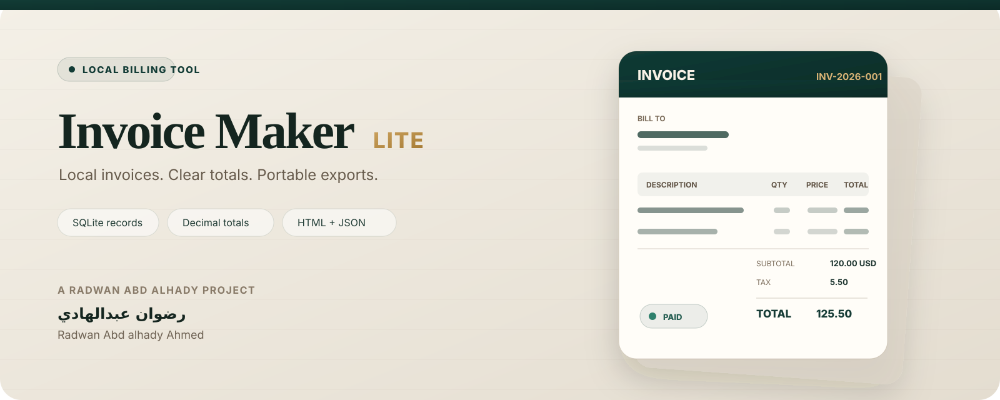

 

# Invoice Maker Lite

### Local-first invoicing with precise totals, SQLite records, and portable exports

**[English guide](README_EN.md) · [الدليل العربي](README_AR.md) · [Architecture](docs/ARCHITECTURE.md) · [Brand](docs/BRAND.md) · [Security](SECURITY.md)**

---

## A small invoice workflow that stays local

**Invoice Maker Lite** is a Python CLI for creating invoices, calculating totals with Decimal arithmetic, storing records in SQLite, tracking invoice lifecycle status, and exporting HTML or JSON.

**باختصار:** أداة محلية للفواتير تحفظ السجلات في SQLite، وتحسب المبالغ بدقة عشرية، وتتابع حالة الفاتورة، وتصدر HTML أو JSON من دون خدمة سحابية.

| Capability | Current behavior |
|---|---|
| Line items | Description · quantity · unit price |
| Money math | Decimal arithmetic with two-place half-up rounding |
| Tax | One invoice-level percentage |
| Discount | One fixed invoice-level amount |
| Storage | Local SQLite database |
| Lifecycle | <code>draft</code> · <code>sent</code> · <code>paid</code> · <code>void</code> |
| Search | Status filter + partial customer name |
| Export | HTML + JSON |
| PDF workflow | Browser Print → Save as PDF from HTML |
| Safety | Duplicate protection · explicit overwrite · explicit delete confirmation |
| Network | No application-level network requests |

---

## Quick start

~~~bash
git clone https://github.com/rad03i2/invoice-maker-lite.git
cd invoice-maker-lite

python -m venv .venv
# Windows: .venv\Scripts\activate
# macOS/Linux: source .venv/bin/activate

python -m pip install -e .
invoice-maker --version
~~~

Create an invoice:

~~~bash
invoice-maker new INV-2026-001   --customer "Example Studio"   --issue 2026-09-21   --due 2026-10-05   --currency USD   --tax 5   --discount 10   --item "Design|2|50"   --item "Hosting|1|20"
~~~

List records:

~~~bash
invoice-maker list
invoice-maker list --status draft --customer Studio
~~~

Export:

~~~bash
invoice-maker export INV-2026-001 --format html --output invoice.html
invoice-maker export INV-2026-001 --format json --output invoice.json
~~~

Open the HTML in a browser and use **Print → Save as PDF** when a PDF file is required.

---

## Invoice lifecycle

~~~text
draft
  │
  ├──> sent
  │      │
  │      └──> paid
  │
  └──> void
~~~

The status value is a **local record state**. Invoice Maker Lite does not contact an external payment service to verify whether money was received.

Change status:

~~~bash
invoice-maker status INV-2026-001 sent
invoice-maker status INV-2026-001 paid
~~~

---

## Financial model

For each line item:

~~~text
line total = quantity × unit price
~~~

For an invoice:

~~~text
subtotal = sum(line totals)
taxable  = subtotal - fixed discount
tax      = taxable × tax rate / 100
total    = taxable + tax
~~~

Money values are quantized to two decimal places using Python Decimal with <code>ROUND_HALF_UP</code>.

The current currency validation checks for a **three-letter code format**. It does not query an external ISO currency registry.

---

## Local storage

Default database path:

~~~text
~/.invoice-maker-lite/invoices.db
~~~

Override globally for a process:

~~~bash
# macOS/Linux
export INVOICE_MAKER_DB=/path/to/invoices.db

# PowerShell
$env:INVOICE_MAKER_DB="C:\path\to\invoices.db"
~~~

Or per command:

~~~bash
invoice-maker --db ./demo.db list
~~~

> The application does not encrypt the SQLite database. Protect filesystem access and backups according to the sensitivity of the invoice data.

---

## Commands

| Command | Purpose |
|---|---|
| <code>new</code> | Create and store an invoice |
| <code>list</code> | List/filter invoice records |
| <code>show</code> | Show one invoice |
| <code>status</code> | Set lifecycle status |
| <code>export</code> | Write HTML or JSON |
| <code>delete</code> | Delete a record with explicit <code>--yes</code> |

Example JSON inspection:

~~~bash
invoice-maker show INV-2026-001 --json
~~~

Explicit deletion:

~~~bash
invoice-maker delete INV-2026-001 --yes
~~~

---

## Export safety

HTML export escapes customer-controlled strings before inserting them into the generated document.

Existing export files are protected unless <code>--overwrite</code> is supplied.

Exports are written to a temporary sibling file first and then moved into place.

---

## Quality checks

~~~bash
python -m pip install -e . pytest
python -m pytest -q
invoice-maker --version
~~~

GitHub Actions runs the suite on **Ubuntu, Windows, and macOS** with Python **3.10, 3.12, and 3.13**.

The current tests cover totals and rounding, date validation, SQLite round-trip, status changes, filtering, duplicate protection, HTML escaping, and export overwrite protection.

---

## Repository map

~~~text
invoice-maker-lite/
├── assets/
│   ├── project-cover.svg       Ledger Paper repository hero
│   └── project-logo.svg        square invoice mark
├── docs/
│   ├── ARCHITECTURE.md         data flow and implementation boundaries
│   └── BRAND.md                visual identity system
├── examples/
│   └── sample-invoice.json     fictional safe example
├── src/invoice_maker/
│   ├── core.py                 validation and money calculations
│   ├── storage.py              SQLite persistence
│   ├── render.py               HTML / JSON exports
│   └── cli.py                  command-line interface
├── tests/
│   └── test_invoice.py
├── .github/
│   ├── ISSUE_TEMPLATE/
│   ├── PULL_REQUEST_TEMPLATE.md
│   ├── CODEOWNERS
│   └── workflows/ci.yml
├── README_EN.md
├── README_AR.md
├── CHANGELOG.md
├── SUPPORT.md
├── SECURITY.md
├── CONTRIBUTING.md
└── LICENSE
~~~

---

## Current boundaries

Invoice Maker Lite currently does **not** provide:

- a bundled PDF rendering engine;
- payment processing or payment verification;
- email delivery;
- recurring billing;
- currency conversion;
- accounting-platform integrations;
- cloud sync;
- encrypted SQLite storage;
- multi-user concurrency controls;
- richer multi-rate tax models.

These are boundaries, not hidden features.

---

## Project identity

The **Ledger Paper** identity combines premium invoice stationery with a restrained software aesthetic. Deep emerald represents dependable records; muted gold highlights totals and document status.

**Developer:** **Radwan Abd alhady Ahmed** · **رضوان عبدالهادي**  
GitHub: [@rad03i2](https://github.com/rad03i2)

 

---

## License

MIT — see [LICENSE](LICENSE).
